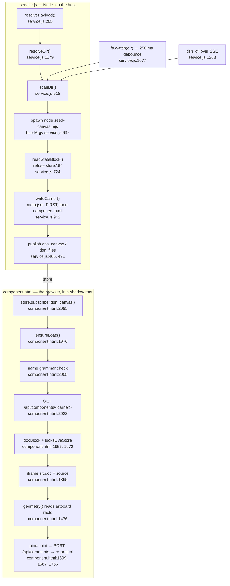
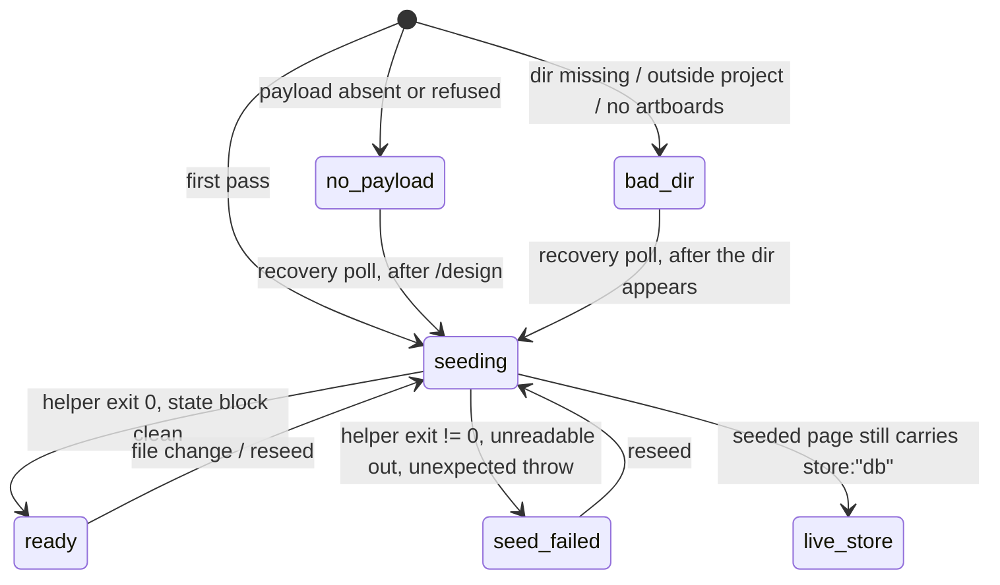

# Architecture

How `wc-design` actually works, for someone who has just cloned it and wants to
understand the machine before changing anything.

`CONTRACT.md` is the normative interface — what the code *must* do. This note is
the opposite: what the code *does*, why the shape is what it is, and which parts
will bite you. Everything below cites real `file:line` in this repo. Line numbers
drift; the surrounding comments are the durable landmark.

---

## 1. Orientation

The pack ships **one component**, `design-canvas`, and that component ships
exactly four files (a web-chat component always does — that constraint explains
more of this codebase than anything else):

| file | runs where | job |
|---|---|---|
| `components/design-canvas/service.js` | Node, on the host, supervised by the daemon | find the editor payload, run the seeding helper, write the carrier, watch files, publish store keys |
| `components/design-canvas/component.html` | the browser, inside a shadow root | render chrome + one screen per state, fetch the carrier, mount the frame, draw pins |
| `components/design-canvas/seed.js` | the browser, once, when the drawer spawns the component | propose default params from what this surface already knows |
| `components/design-canvas/meta.json` | read by the daemon | name, description, `params_schema` |

Plus three host-side scripts that are not part of the component and never run on
a user's surface: `scripts/find-payload.mjs` (the same discovery logic, as a CLI),
`scripts/check-no-vendored.mjs` (the tripwire), `scripts/lint-pack.mjs` (pack
validation against web-chat's own validator).

The one-sentence shape:

> The service seeds Anthropic's canvas editor — a copy already sitting on the
> user's disk — with the user's own `.dc.html` artboards, parks the 2.4 MB result
> where the daemon's components route will serve it, and tells the pane where to
> find it over the store. The pane fetches it and mounts it in a same-origin
> `srcdoc` iframe, then draws comment pins on top by reading the frame's
> artboard geometry.

Two properties fall out of that and constrain everything:

1. **The pipeline is one-way.** `.dc.html` files → canvas. Nothing travels back.
   The pack serves the frame no host capability object at all, so the editor
   boots read-only from its embedded seed; a design is changed by editing the
   files on disk and letting the service re-seed. See `CONTRACT.md` §9.5.
2. **The service never writes inside `dir`.** The user's working files are the
   user's. Enforced, not asserted — §4.3 below.

---

## 2. The end-to-end path



Note what is *not* on that diagram: the payload never passes through a tool
argument, the pane's `html`, the store, or a graph node. It goes from a file the
service wrote to a `fetch` the pane made, and then into an iframe. That is the
whole point of §5.

---

## 3. Discovery — finding the payload, never vendoring it

### 3.1 What is being found

Two files that Claude Code materialises out of itself the first time its bundled
`design` skill runs in a session:

```
<tmp>/claude-<uid>/bundled-skills/<claude-version>/<nonce>/design/
├─ payload.template.html    ~2.4 MB   the precompiled canvas editor
└─ seed-canvas.mjs          ~40 KB    the seeding / extract / check helper
```

`service.js:95-103` and `scripts/find-payload.mjs:39-52` hold identical copies of
that shape. Three things about the path are easy to get wrong and were:

- **The temp root is not `$TMPDIR`.** It is `CLAUDE_CODE_TMPDIR || '/tmp'`, a
  hardcoded literal. On macOS `/tmp` resolves through a symlink to `/private/tmp`,
  which is the only reason observed paths look like that. `$TMPDIR`
  (`/var/folders/…`) is never consulted.
- **The 32-hex segment is a per-process nonce, not a content hash.** It differs
  every run and sibling nonce directories accumulate. Never key on it: enumerate,
  then rank (`findCandidates`, `service.js:177-199` — newest version first,
  then newest `mtime` within a version).
- **There is a `claude-<uid>` segment** between the temp root and
  `bundled-skills`. Both roots are searched (`BUNDLED_ROOTS`, `service.js:96-99`)
  because builds have been seen without it.

Recognition is a single marker string sniffed in the first 64 KB
(`service.js:216`) — the file is 2.4 MB and nothing needs it in memory.

### 3.2 The ownership gate

This is the security-relevant half, and it is why discovery is not a five-line
function. `service.js:109-164`.

The *second* search root, the bare `<tmp>/bundled-skills`, lives directly under a
world-writable sticky directory. Nothing owns that path — any local principal can
create it. Ranking is by version string and the only content test is a 25-byte
marker, so an unprivileged `<tmp>/bundled-skills/99.0.0/<anything>/design/` would
outrank the real install. The service would then spawn *that* `seed-canvas.mjs`
as the user and mount *that* HTML same-origin with the daemon — the realm §6.2
describes.

So every level from the search root down to `design/`, plus both files in it,
must be:

- owned by this uid (`st.uid !== TRUST_UID` → refuse, `service.js:152`);
- not a symlink — `lstat`, never `stat`, so a link is judged as itself
  (`service.js:149-150`);
- not group- or world-writable (`(st.mode & 0o022) === 0`, `service.js:153`).

The supported tree passes untouched (`drwx------` all the way down, `-rw-------`
on both files). The gate runs **before any read of the candidate**
(`service.js:212`), and the refusal is recorded on the candidate record rather
than dropping it, so `resolveUpstream` can *name the path it refused*
(`service.js:1146-1163`) instead of reporting a bare "not found" and sending the
user to run `/design`, which would not fix it.

`TRUST_UID` is `null` where POSIX ownership does not apply (Windows), and the
gate no-ops there (`service.js:145`).

### 3.3 Why it is never vendored

The pack ships zero upstream bytes and contains no code that extracts anything
from the Claude Code executable. It reads the copy Claude Code itself wrote to
the user's temp directory — ordinary use of installed software. If that copy is
absent, the answer is "run `/design` once", published as a first-class state
(`no-payload`) with that exact hint, not as a fallback.

Three mechanisms keep that true under maintenance:

- `.gitignore` blocks `payload.template.html`, `seed-canvas.mjs`, `*.payload.html`,
  every root-level `.html` (the helper's `--out` is a title slug, so a
  hand-seeded canvas lands under a name no pattern predicts) and
  `.wc-design-build/`.
- `scripts/check-no-vendored.mjs` fails CI if any **tracked** file matches a hash
  in `upstream.lock.json`, carries an upstream marker, or exceeds 256 KB. Files
  that must *name* a marker in order to detect it declare a pragma in their own
  header (`check-no-vendored.mjs:53-56`) — a pragma rather than a path allowlist,
  because a path list goes stale the moment a file is renamed. The pragma exempts
  only the marker rule; the hash and size rules still apply, so a pasted payload
  is still caught.
- `upstream.lock.json` carries fingerprints only. `scripts/relock.mjs`
  regenerates it from the local install after a Claude Code upgrade.

---

## 4. Seeding — what the helper is handed, what comes back

### 4.1 The helper is the reuse surface

`seed-canvas.mjs` is a readable, dependency-free, heavily commented script that
ships in the clear next to the payload. It is the documented way in. **We program
against the helper, not against the editor**, and we run it as a child process
rather than reimplementing its transform.

Its three modes dispatch in a fixed order a caller cannot override
(`--extract` → `--check` → seed as the fall-through default). This pack only ever
invokes the seed mode; `--extract` is the helper's way back into files from a
canvas edited *somewhere else*, it is the user's command, and this pack never
runs it — which also means the helper performs exactly one write per invocation,
to `--out`.

### 4.2 Building the argv — the trap

`buildArgv`, `service.js:637-671`. The helper's argument parser is hand-rolled and
its scan loop is bounded by `process.argv.length - 1`, which means:

> **a flag that is the final argv token contributes no value and reads as
> absent.**

A trailing `--title` makes the helper say "need `--template`, `--out`,
`--title` …" and exit 1, with no hint that the value was simply never seen. So
the argv is built as **pairs**, never as a flat list (`service.js:646-666`), and
the structure carries the rule: a flag is only ever emitted with its value, the
final token is therefore always a value slot, and an assertion at
`service.js:667-669` makes that structural rather than a convention.

Two things deliberately *not* done there, both noted at the call site:

- No "does the last token start with `--`" test. A title may legally begin with
  `--` and is read correctly; only a flag with nothing after it loses its value.
- No pre-validation of the title or the artboard names. Artboards and
  `canvas.json` are passed through verbatim even when the name looks wrong,
  because the helper's own refusal names the file and the rule, and its stderr is
  written to be read. Images are the one exception (`service.js:242-253`): they
  are incidental assets, one stray photo must not take the whole canvas down, so
  an image the helper would fatally refuse is skipped and reported in
  `dsn_files.skipped`.

Other parser facts the caller must respect: no `=` form, no short flags, no `--`
terminator, unknown flags ignored silently, repeated single-valued flags are
last-wins, `--artboard` and `--image` repeatable with order preserved.

`--out` is content, not a temp name — the helper refuses a generic one. The slug
is derived from `title` and re-checked against the helper's own two gates so we
fail here, legibly, rather than in the child (`slugFromTitle`,
`service.js:396-413`).

### 4.3 What the child is allowed to touch

The invariant is "this service never writes to `dir`", and it is enforced at four
levels:

1. `assertWritable()` (`service.js:355-364`) is the single gate every write in the
   file passes through. It throws for any path outside the two write roots
   (`<webChatDir>/.wc-design-build/<carrier>/` and
   `<webChatDir>/components/<carrier>/`) **and**, belt-and-braces, for anything
   inside `dir`. `grep -n 'fs\.\(writeFileSync\|renameSync\|rmSync\|mkdirSync\)'`
   over `service.js` — every hit's path is an `assertWritable()` return value.
2. Writes go through `writeAtomic()` (`service.js:368-375`): sibling temp then
   rename, so a reader of `GET /api/components/:name` never sees a half-written
   2.4 MB file.
3. The child's `--out` is asserted **before the spawn** (`service.js:788`), so the
   invariant covers the child's write as well as ours.
4. The child is spawned with `cwd` set to the build dir (`service.js:684`), so
   even a relative write inside it could not land in `dir`.

Reads of `dir` go through `ctx.fence` — the daemon's own containment engine,
which refuses a lexical `../..` *and* a symlink that resolves out of the tree
(`fenceInsideDir`, `service.js:509-514`). A file that fences to null is skipped
before a single byte is read (`service.js:539-540`).

### 4.4 What comes back

The helper writes one self-contained HTML document. Before it becomes the
carrier, the service reads its state block the way the helper's own recognizer
does (`readStateBlock`, `service.js:723-734`) — matching the block opener and
slicing to the first literal `\n</script>`, rather than regexing 2.4 MB for a key,
which can false-positive on the editor's own minified JS.

Then the one refusal that matters:

> **A page whose state block carries `store:"db"` is refused as state
> `live-store`** (`service.js:849-859`). Such a page boots read-only against a
> live store no matter what a host offers it. Our own seeding output can never
> carry it, so this is defence in depth against the payload's transform changing
> under us — and the pane runs the same check independently on the document it
> fetched (`looksLiveStore`, `component.html:1972-1974`).

The success path records a file-set fingerprint (`name:bytes:mtime` joined,
`service.js:583`) which is the short-circuit that stops a burst of `fs.watch`
events — an editor writing a file three times per save — from becoming a re-seed
storm (`service.js:775-779`). `dsn_ctl {op:'reseed'}` sets `force` and skips that
short circuit, because the user reaches for Reseed precisely when the canvas
looks wrong (`service.js:749-751`).

Exit-0 stderr is not discarded: it is split into `dsn_canvas.warnings`
(`splitWarnings`, `service.js:739-745`) and rendered as a banner
(`component.html:961-974`). "Seeded with warnings" and "seeded cleanly" are
different claims, and the helper's advisory output is the only place the
difference is visible.

---

## 5. The carrier trick — how 2.4 MB reaches the browser

This is the least obvious part of the design and the part most likely to be
"simplified" by someone who does not know why it is like this.

### 5.1 The constraint

web-chat's daemon has **no CSP on the surface, no sanitisation on the render path
and no size cap** — the express body limit is 200 MB. So the constraint is not a
gate. It is **amplification**:

- `lib/server/graph.js` snapshots the whole store into every committed node;
- a mount's `html` is likewise a per-node snapshot field.

A 2.4 MB pane `html` or store value would therefore be **copied into every
committed graph node on disk, forever**. The payload must arrive as a *file* and
must never enter the graph, the store, or an MCP tool argument.

### 5.2 What was rejected, and why

| route | why not |
|---|---|
| put the canvas in the pane's own `html` | snapshotted into every committed graph node |
| put it in the store | `POST /api/store` puts the whole patch into the event ring, the WS frame and every SSE subscriber — and `get_store` would hand 2.4 MB to Claude |
| a second loopback HTTP server with `access-control-allow-origin: '*'` | re-introduces the exact regression `lib/core/cors.js` documents having removed: any page the user visits could scan loopback and read their design content |
| `iframe src=file://` | browsers block an http→file frame navigation outright |
| pass it through a tool argument | same graph-node amplification, plus it would sit in the transcript |

### 5.3 What ships instead

`GET /api/components/:name` returns `{…meta, source, has_service}` where `source`
is that component's `component.html`. It is same-origin, behind
`requireLocalHost`, needs no new listener, no CORS and no trust gate. And the
components registry does a **fresh `readdirSync` per call with no caching**, so a
component written at runtime is picked up with no restart.

So the service writes a **runtime-only carrier component** —
`<webChatDir>/components/design-canvas-payload-<8 hex>/` — whose `component.html`
*is* the seeded canvas (`writeCarrier`, `service.js:942-954`), and publishes its
name on `dsn_canvas.payload_component`. The pane fetches it
(`component.html:2022`) and drops the string straight into an iframe's `srcdoc`.

Four details that are load-bearing:

**Per-mount name.** `carrierNameFor(mountId)` (`service.js:390-392`) folds a short
hash of the mount id into the name, so two `design-canvas` panes on one node
cannot clobber each other's payload. The pane never hardcodes the name; it reads
`dsn_canvas.payload_component`. The name must satisfy web-chat's
`COMPONENT_NAME_RE` (`^[a-z][a-z0-9-]*$`) — hex does.

**The carrier must not be mountable.** It appears in `list_components`, in the
drawer and in the ⌘K palette, and **one accidental mount writes 2.4 MB into every
committed graph node forever**. Two defences, both in `carrierMeta()`
(`service.js:911-940`):

- `params_schema.properties` must be **non-empty**, because the drawer mounts
  immediately when a component has no properties;
- the one required property has `enum: []`, so the form renderer builds a
  `<select>` with zero options, its value is always `''`, and its submit handler
  refuses with `'<key>' is required`. The form can never be submitted, so the
  mount can never happen.

The description leads with "Data carrier, NOT a pane — do not mount this."

**Write order matters.** `meta.json` goes first, always (`service.js:944-953`).
The registry falls back to `params_schema: {}` when `meta.json` is missing or
unparseable — and an empty schema is exactly the case the drawer mounts
*immediately*. A window in which `component.html` exists without its `meta.json`
is a window in which one drawer click writes 2.4 MB into the graph. The reverse
window is harmless: `list()` tolerates a directory with no `component.html`, and
the pane only fetches after `dsn_canvas` says `ready`, published after both
writes land.

**Cleanup.** `removeCarrier()` on stop (`service.js:968-977`) is guarded on the
pid recorded in `meta.json`, so a stop racing a start cannot delete a live
payload a fresh child just wrote. `sweepStaleCarriers()` (`service.js:984-997`) is
the backstop for a SIGKILLed predecessor: it only ever touches a directory whose
name matches the carrier pattern **and** whose `meta.json` carries our marker
**and** which is at least a week old.

---

## 6. Mounting — `srcdoc`, same-origin, and the boundary that creates

### 6.1 Why `srcdoc`, and why same-origin

`mountFrame`, `component.html:1395-1409`. The fetched source is assigned to
`iframe.srcdoc`. A `srcdoc` frame **inherits the embedding origin**, and that is
not incidental — it is the entire reason pins are possible:

- The editor's host link is a JavaScript capability object. There is no
  postMessage host protocol; all postMessage traffic in the payload goes
  *downward* into its own artboard child frames. So a cross-origin host is
  structurally impossible, not merely degraded.
- Even without injecting any capability, the pane needs to **read artboard
  geometry** out of the frame (`getBoundingClientRect` on
  `[data-mega-artboard]`, `component.html:1418-1423`, `1476-1494`). An opaque
  origin cannot be read from at all.

`isolate: true` (`component.html:1404`) sandboxes the frame to an opaque origin
with `allow-scripts allow-downloads` — `allow-downloads` kept so the canvas's own
PNG/PDF export still works. The cost is **total**: no geometry, therefore no
anchors, therefore **pins are unavailable, not degraded**. `frameDoc()` returns
null under isolate by construction (`component.html:1412`), the pin button is
disabled with that reason as its tooltip (`component.html:916-918`), and a banner
says so (`component.html:947-951`).

### 6.2 The trust boundary

Stated plainly, because it must not be soft-pedalled: **a same-origin frame is
inside the daemon's trust boundary**, and the only gate on the whole local API is
a Host header check (`requireLocalHost`). Content in that frame can:

1. **Read every private pin, with its text.** `GET /api/comments` without
   `shared_only` returns unshared pins — exactly what web-chat keeps pins out of
   the store to prevent.
2. **Forge pins into Claude's context.** The comment branch of the queue
   classifier has no source gate and no routing gate, comment items are recorded
   as `source:'browser'`, and `params.routing:'none'` does not suppress them.
3. **Reach `POST /api/packs/install`.**

That exposure is inherent to the capability path, not to any one design. The
invariants that make it survivable are the reason several checks exist that would
otherwise look paranoid:

- **Only ever display canvases seeded from the user's own local `.dc.html`
  files** — never someone else's published canvas, never an Artifact URL. Then
  the content in the frame is Anthropic's editor plus the user's own design.
  This is enforced where the bytes are *chosen*, in three places:
  the ownership gate on discovery (§3.2); the name-grammar check on
  `payload_component` before any fetch (`component.html:2005`, mirroring
  `service.js` `CARRIER_RE` — keep those two in sync); and the `live-store`
  refusals at both ends.
- **The pane never serves the frame a capability object**, so the editor boots
  read-only from its embedded seed and never fetches cross-user published
  content.
- **Anything read out of the frame is untrusted input.** It goes through
  `capFrame()` (`component.html:734-742`) — 60 characters, control characters
  flattened — before it is shown, stored, or handed to Claude. Both halves are
  load-bearing: 60 chars because the server interpolates `anchor.text` straight
  into the `anchor_label` string `get_comments` returns; control characters
  because a POSIX filename may legally contain a newline and a `.slice(60)` alone
  would let one through into a prompt. Note it is written as a char-code walk
  rather than a regex, deliberately, so no transport can mangle an escape
  sequence into a class that means something else.
- The pane builds DOM with `document.createElement`/`createTextNode` throughout
  and never `innerHTML` (`component.html:22-25`, helpers at `661-709`), because
  much of what it renders came out of that frame.

`referrerpolicy="no-referrer"` is set on the frame (`component.html:1399`).

### 6.3 Why the pane script looks the way it does

Two web-chat runtime facts shape the whole file, both called out in its header
(`component.html:17-25`):

- The script body is compiled as
  `new Function('store','root','params','mountId', body)`. **Top-level `await`,
  `import` and `export` are SyntaxErrors** — the script never compiles and fails
  near-silently into `onError`. Every `await` in the file sits inside an async
  function: the IIFE in `run()` (`component.html:2088-2090`) or an async handler.
  This is also why the anchor library is *inlined verbatim* rather than imported
  (`component.html:287-604`) — there is no module system here, and a component
  ships exactly four files anyway.
- **`document.querySelector` cannot see into the shadow root.** Every query goes
  through the injected `root` (`$`, `component.html:616`). `document.createElement`
  is fine and is used throughout.

The anchor library's source of truth is `scratch/anchor-lib.js`; the copy in the
pane is delimited by `@@ANCHOR-LIB-BEGIN@@` / `@@ANCHOR-LIB-END@@` and the exact
`awk` incantation to extract and diff it is written at the end marker
(`component.html:605-611`). `test/uc-port.test.mjs` proves the port equivalent to
the payload's own implementation by extracting that implementation **at test
time from the local install**, never from a committed copy — so the test is
meaningless on a machine without Claude Design, and skips with a clear message
rather than passing vacuously.

---

## 7. Pins — click to anchor to re-projection

web-chat has a comment-pin system with no canvas geometry. The canvas has
geometry and renders no pins of its own. This section is the join.

### 7.1 The path

```
overlay click (armed)
  → hitTest(cx, cy)                       component.html:1579
      geometry(): artboard rects from the frame, corrected
  → { artboard file, fx, fy }             fractions of the artboard box
  → mint()                                component.html:1599
      A.artboardAnchor(file, fx, fy)      → "dca<hash12><fx4><fy4>:nth-of-type(1)"
      label = capFrame(file · 42%,77%)
      anchor.dsn = drift fingerprint
  → POST /api/comments                    component.html:1689
      { text, shared, anchor:{mount, selector, text, ordinal, dsn} }
  → pollPins() every 4 s                  component.html:1728
      decorate(): validate + parse back    component.html:1707
  → layoutMarkers()                       component.html:1766
      x = box.left + fx*box.width - frameRect.left
  → pump() on rAF, ≥60 ms apart           component.html:1924
```

### 7.2 Anchor grammar

The anchor is a synthetic CSS-selector string in the payload's **own** grammar,
so the strings hand straight to the canvas's comment capability if a future
version injects one, with zero migration:

```
artboard anchor:  dca<fileHash12><fx4><fy4>:nth-of-type(1)
```

- `fileHash12` — 12 hex digits (the low 48 bits) of a 53-bit hash of the
  artboard's **file path**. Implemented at `component.html:403-423`. Every step is
  byte-load-bearing: `Math.imul` for 32-bit multiplies (plain `*` overflows into
  float and silently produces a different hash), the finalisation order,
  `padStart(14,'0').slice(-12)` as a truncation rather than a re-hash, iteration
  over UTF-16 code units. Do not "clean it up"; `test/uc-port.test.mjs` will tell
  you.
- `fx4` / `fy4` — a fraction encoded as `round(clamp01(v) * 9999)` zero-padded to
  4 digits (`component.html:437-444`). A non-finite value becomes `0.5` **before**
  the clamp: clamping `NaN` yields `NaN`, and `String(Math.round(NaN)).padStart(4,'0')`
  is the literal `"0NaN"`, which mints an anchor the grammar's own parser rejects.

The grammar admits four kinds (`e` element, `a` artboard, `n` note, `c` canvas
point). **v0.1.0 mints only `a`** — artboard-level. Element precision needs the
capability object, and that is a v0.2 question.

### 7.3 Validation runs in both directions

`validateAnchor` (`component.html:485-545`) is applied to anything minted here
*before* it becomes durable data and to anything read back out of the store. That
is not belt-and-braces: **the web-chat server stores `anchor` verbatim with zero
validation**, and its `describeAnchor` does not truncate `selector`. An unbounded
or malformed anchor read from the frame would otherwise flow straight into
Claude's context. The rules: ≤1024 chars, ≤10 `" > "` segments, final segment
matching the grammar with `:nth-of-type(1)` exactly. **An invalid anchor is
dropped, never stored** (`component.html:1602-1604`, `1710-1712`).

Worth knowing: on an unmodified web-chat, `dca…:nth-of-type(1)` is *syntactically
valid CSS that matches nothing*, so the shell's own marker layer skips it rather
than throwing. The pane draws the markers itself.

### 7.4 Geometry, and the one correction

The canvas positions each artboard as an absolutely positioned box inside a
single `translate(…) scale(…)` transform and stamps the artboard's file key on it
as `data-mega-artboard`. Reading **rects** rather than the transform means pan,
zoom, focus mode and any future layout come out right for free.

`correctBox()` (`component.html:1459-1475`) handles the one wrinkle: a fixed
header hoist means the element's *top* can sit above the artboard, while bottom,
left and width are always exact. If the store's own artboard index gives `w`/`h`,
the true height is `h * (rect.width / w)`; a small positive delta is the hoist and
is corrected; anything else means the index does not describe what is on screen
(a focus-mode override, a stale `canvas.json`) and the raw rect is the more
honest answer, flagged `exact:false`.

Hit-testing is done here against those rects rather than through the frame's own
`elementFromPoint`, because the canvas stacks full-bleed overlays of its own and
`elementFromPoint` would return one of those and resolve to no artboard at all
(`component.html:1454-1458`).

### 7.5 Drift

A fraction anchor survives an artboard rewrite and then points *confidently* at
whatever moved into 42%,77%. So a cheap fingerprint rides with the pin
(`component.html:1633-1642`): artboard box dimensions plus a hash of the
artboard's serialised source, read from the child iframe's `srcdoc` **attribute**
— reading an attribute is not a cross-origin read (`srcFingerprint`,
`component.html:1511-1522`). A changed fingerprint renders the marker as "may have
moved" rather than as healthy (`drifted`, `component.html:1752-1760`). Unknown is
not drift.

The fingerprint rides **inside the pin's own `anchor` object**, deliberately.
Kept in the store instead, it would leak private pin locations to Claude via
`get_store`; inside the anchor it inherits the pin's own shared/private
filtering.

### 7.6 Armed mode, and what it costs

`setArmed` (`component.html:1527-1548`) toggles `pointer-events` on the overlay.
While it is on, **the canvas cannot be panned, zoomed or selected** — every click
lands on the overlay. That is a real cost and the pane says so out loud in the
armbar (`component.html:1556-1570`) rather than leaving the user to discover a
dead canvas. Escape leaves the mode; if the shell's own pin mode is also on, the
flash warns that its pins will land on this overlay instead
(`component.html:1535-1539`).

A pin whose artboard is off screen or absent is **docked, never dropped**
(`paintDock`, `component.html:1811-1832`) — with an honest tooltip that this build
cannot recentre the canvas for you.

---

## 8. Service lifecycle — including the one that bites

### 8.1 Shape

```js
module.exports = { name: 'design-canvas', start, stop };   // service.js:1427
```

The forked runner tests `typeof svc.start === 'function'` and **silently no-ops
otherwise**. A bare exported async function means the service never starts and
the pane waits forever with no error anywhere. `ctx` is
`{ driver, params, mountId, name, log, diff, webChatDir, fence }`.

`ctx.driver.setStore(patch)` takes the patch **directly** — the `{patch:{…}}`
wrapper belongs to the MCP `set_store` tool, and the driver adds it itself
(`service.js:55-59`). Getting this wrong is a silent no-op that still returns ok.

`start()` (`service.js:1332-1396`) runs: reset module state → sweep stale carriers
→ **adopt seq floor** → resolve payload → resolve dir → first seed → install
watch, control stream and poll. A resolution failure publishes its state and
returns early — but **still installs the control loop** (`service.js:1383-1386`),
because the pane's Reseed button is dead without it and the fix (running
`/design`, creating the directory) happens outside this process.

### 8.2 The trap: a per-start seq counter makes the pane permanently deaf

This is the bug that is worth the whole section. Read `service.js:431-461` and
`component.html:796-826` together.

The mechanism:

- The supervisor **stops the service child whenever the last browser stops
  watching** — viewer count reaches zero, the desired-services map goes empty,
  the child is killed — and respawns it when a browser comes back.
- But the browser's reconnect handshake is a **reconcile**, and a reconcile
  deliberately does **not** re-mount a pane whose spec is unchanged. The pane
  script survives the gap, still running, **still holding its old seq
  high-water mark**.
- So a fresh child that starts its counter at 1 publishes `seq: 1, 2, 3 …`, all
  below the pane's high-water mark, and every one of them is **dropped on
  arrival**.

The symptom is the nasty part: the canvas keeps rendering the stale document,
file edits stop landing, and Reseed *acknowledges and does nothing*. The pane
looks perfectly healthy and is inert until a remount. Nothing logs an error.

The fix is two-sided, and both sides are needed because neither can assume the
other:

1. **Service side — adopt a floor.** `adoptSeqFloor()` (`service.js:451-461`) does
   one `getStore(['dsn_canvas','dsn_files'])` before the *first* publish
   (including the failure publishes in `resolveUpstream`/`resolveDir` — hence it
   runs at `service.js:1372`, above everything) and raises `seq` to whatever the
   store already carries. Failure is harmless: no store, no floor needed.
2. **Pane side — treat a regression as a restart, not a replay.**
   `accept()` (`component.html:816-826`) still refuses a **repeat**
   (`q === lastSeq`) — that is what a replayed snapshot looks like, and it is the
   case the guard was written for. But a strict **regression** is read as "a new
   writer started counting again", logged as a warning, and adopted. This is safe
   because the server's store is authoritative: a lower seq cannot arrive from
   behind, since sync only publishes keys that differ from what the client
   already holds.

The pane's own outgoing counter has the mirror-image problem — a remount must not
restart below a seq already spent — so `nextSeq()` (`component.html:832-841`)
outranks both its own counter and whatever is currently in the store, seeded from
`Date.now()`.

### 8.3 The rest of the loop

**Watching.** `fs.watch(dir)`, non-recursive (the helper stores each file under
its **basename**, so a nested `img/logo.png` and a top-level `logo.png` would
collide as one entry), 250 ms debounce, filtered to `*.dc.html`, `canvas.json`
and image extensions; a null filename from the platform means "something changed"
and forces a rescan (`service.js:1061-1093`).

**Serialisation and coalescing.** All work runs on a promise chain (`enqueue`,
`service.js:1003-1009`). A change arriving mid-seed sets a flag instead of
spawning a second helper; when the running seed finishes it runs exactly once
more, and a forced request arriving mid-seed still forces the follow-up
(`requestSeed`, `service.js:1038-1055`).

**Every pass ends in a published state.** `seedGuarded` (`service.js:1020-1034`) is
the backstop: `seedNow` names a state on each of its own failure paths, but an
unexpected throw would otherwise unwind into `enqueue`'s `.catch`, which only
logs — leaving the store holding whatever was published last, which on a first
mount is `seeding`. A pane on a progress bar forever with `error:null` is
precisely the failure the state contract exists to forbid.

**The poll** (`installControlLoop`, `service.js:1279-1325`, every 5 s) does four
jobs, in priority order:

1. control-key fallback (the SSE stream does not auto-reconnect);
2. **recovery** — while `degraded`, silently re-run resolution, so a user who runs
   `/design` or creates the directory heals the pane **without a remount**. The
   silence is what makes it possible to retry every few seconds without spamming
   the store with `seq` bumps; only success speaks;
3. **self-heal** — this service is not the store's only writer. A surface wipe or
   a graph re-aim to a node that predates us leaves our keys gone while nothing
   on disk changed. The pane is store-driven, so no store means no pane:
   republish rather than wait for a file to change. Same for a carrier that
   vanished under a `.web-chat` clean-out;
4. anything `fs.watch` missed (network mounts, editors that replace the directory
   entry) — one readdir plus a stat per file, compared against the fingerprint.

There is one subtlety in `bootstrapAndSeed` (`service.js:1230-1247`) worth reading
twice: when the payload appears under a *recovery* pass, `silent` is deliberately
flipped back off, because whatever we are about to say about `dir` is **new**
information. Otherwise a mount that is both payload-less and dir-less heals the
payload silently and leaves the pane showing `no-payload` — with the wrong hint —
for a `bad-dir` problem.

**Control key.** `dsn_ctl {seq, op}` with `op` `reseed` or `rescan`, accepted only
on a strictly increasing seq (`acceptCtl`, `service.js:1102-1110`). A control write
that predates the child is adopted rather than replayed (`service.js:1253-1259`) —
the startup seed already did the work `reseed` would ask for. **This is a service
reaction, not a declared signal: a user panning, zooming, reseeding or rescanning
never wakes Claude.**

**Trust.** A service is host code and does not start until the user runs
`claude-web-chat trust design-canvas` in their **terminal**. The pane can name
that command and cannot grant it — its own script runs in the page being
approved. Consent is keyed on (project root, `service.js` contents, params), so
editing the service or changing `dir` / `title` / `isolate` / `watch` asks again;
render-control params (`routing`, `signals`, `form_reset`) are stripped before the
fingerprint and never re-ask. This is also why `seed.js`'s complete-return branch
spells out the documented defaults verbatim (`seed.js:111-152`): matching the
shape `SKILL.md` tells Claude to mount with means a drawer spawn reuses the same
approval instead of prompting for a second one.

---

## 9. The state machine

There are **two** state axes, and conflating them is the easiest way to get lost.

### 9.1 Service state — `dsn_canvas.state`, a closed set of six

Published in **every** state including failure (`publish`, `service.js:465-486`),
always carrying `error` (human prose) and `hint` (**the one action that fixes
what actually happened**).



The hint is state-specific by design, not decorative:

| state | hint |
|---|---|
| `no-payload` (not materialised) | "Run `/design` once in Claude Code." |
| `no-payload` (ownership gate refused N paths) | names the refused paths and says to delete them / drop group+other write — **not** "run `/design`", which would not fix it (`service.js:1146-1163`) |
| `bad-dir` | the specific defect: missing param, not absolute, outside the project, does not exist, is a file, contains web-chat's own directory (`service.js:1179-1225`) |
| `seed-failed` | **the helper's stderr, verbatim** (`service.js:806-812`) — it is written to be read, and only an absurd volume is capped, with the cap saying so |
| `live-store` | "Refuse it… open it in its published Artifact instead." |

Note `bad-dir` catches one case up front that would otherwise surface as a
mid-seed throw: a `dir` that **contains** either write root — the natural way to
reach which is passing the project root itself, since `<root>/.web-chat` lives
inside it (`service.js:1215-1221`). A refusal from inside `seedNow()` is not a
state the pane can name; this is a `dir` problem and `bad-dir` is what says so.

### 9.2 Pane load state — a second axis

`loadState`, declared at `component.html:764`: `idle`, `loading`, `ok`, `http`,
`net`, `live-store`, `not-canvas`, `empty`, `noname`, `badname` (the last set at
`component.html:2007`). It only advances once the service says `ready` — `paintStage()`
(`component.html:1166-1193`) checks the service state first, then the secure
context, then the load state.

### 9.3 Why every degraded state must render something specific

The rule is: **an empty box is indistinguishable from a broken pane.** Every
branch in `paintStage` ends in a screen with a title, prose explaining what is
actually true, and where it exists an action — Reseed, Retry, or Ask Claude with
the failure prefilled (`component.html:1162-1164`).

The non-obvious ones, all of which are reachable and none of which are failures
of *this* code:

- **Node previews and glance cards** (`previewScreen`, `component.html:1196-1206`).
  Previews are served with `default-src 'none'` and `connect-src 'none'`, so
  **both** the frame and the fetch are dead there. Detected up front from
  `location.pathname.startsWith('/preview/')` (`component.html:623-625`) and
  rendered as a static card listing the artboards.
- **Frozen exports** (`exportScreen`, `component.html:1315-1325`). The export
  runtime runs pane scripts inside the exported file, against no server — so the
  `fetch` is guaranteed to fail. The screen says the right export of a canvas is
  the seeded `.html` itself, which is already self-contained and interactive.
  (Also worth knowing: a graph node carries `comments`, but the export assembler
  does not take them, so pin threads never survive an export.)
- **Non-secure context** (`insecureScreen`, `component.html:1291-1301`). The
  editor needs a **secure context**, not merely a local one. Working:
  `file://`, `http://localhost`, `http://127.0.0.1`, any `*.localhost`, any
  `https://`. Broken: any other host over plain http — a LAN IP, a bare hostname,
  an mDNS `.local` name. Off a secure context `crypto.randomUUID` is undefined,
  the artboard handshake throws unguarded, and the canvas hangs on a **permanent
  spinner with its toolbar drawn**, which reads as a slow load and never
  finishes. So the check runs **before the frame is ever created**
  (`component.html:1178-1179`) and the frame is deliberately not mounted: a
  permanent spinner tells the user less than this screen does. This matters
  because the obvious next steps — bind `0.0.0.0` so a phone can view it, share
  over a LAN — all break it *silently*.
- **`badname`** (`badCarrierScreen`, `component.html:1341-1350`). `payload_component`
  is an ordinary store value and the store is writable by anything that can reach
  `POST /api/store` — Claude, a local driver, another pane, and (same-origin) the
  canvas frame itself. Unchecked, one store write points the pane at any
  component in the registry and gets its source executed in the daemon's trust
  realm. The name grammar is the containment rule; the screen says nothing was
  fetched and nothing was mounted.
- **`booted === false`** (`probeCanvas`, `component.html:1426-1443`). "It loaded"
  and "it works" are different claims. Only artboards actually present in the
  frame's DOM support the second, so the pane probes five times at 1.5 s and
  raises a banner if none appear. Silence under `isolate` is not a failure and is
  not reported.
- **`dsn_ask` not declared** (`ASK_DECLARED`, `component.html:648-659`). A drawer
  spawn through the form renderer **cannot** carry `signals`, so this is
  reachable, not theoretical. With `routing:'none'` — the documented default —
  the activity safety net is off too, so an undeclared `dsn_ask` write reaches
  *nothing*: no queue item, no activity item, no wake. The pane detects its own
  declaration from `params.signals` and changes what it promises
  (`component.html:1092-1094`), because "queued, hit Push" followed by an empty
  rail is worse than no button.
- **Waiting, escalated** (`waitingScreen`, `component.html:1209-1222`). Six seconds
  with no `dsn_canvas` and the pane names the trust command
  (`component.html:2099`) — the single most likely reason a service-backed pane is
  silent.

Two more rendering rules that are easy to break by accident:

- **Never re-parent the iframe.** Re-parenting reloads it, which re-parses 2.4 MB
  and throws away the user's pan and zoom. `showFrame()` replaces the stage's
  children only when the wrap is not already its sole child
  (`component.html:1378-1384`).
- **The load is keyed on the seed, not on `seq`.** `loadedKey = name + '@' + seeded_at`
  (`component.html:2015`), set *before* the first `await` as a re-entry guard.
  Keying on `seq` would re-fetch 2.4 MB — and reset pan and zoom — every time a
  file's mtime changed.

---

## 10. If you are about to change something

- **`scripts/find-payload.mjs` and the discovery block in `service.js` are
  duplicated on purpose.** A component installs exactly four files, so
  `service.js` cannot import a helper from this repo. Both sites say so. If you
  change the search roots, the ranking, the template marker or the ownership
  gate in one, change the other in the same commit.
- **`CARRIER_RE` in `service.js:292` and the inline regex at
  `component.html:2005` are the same rule in two places.** Same reason.
- **`scratch/anchor-lib.js` is the source of truth for the anchor grammar**; the
  pane copy is generated by hand from it. Edit there, run
  `node --test test/uc-port.test.mjs`, re-inline, then diff with the `awk` line at
  `component.html:605-611`.
- **`seed.js` mirrors the helper's title gate** (`seed.js:59-71`) only so the
  drawer never proposes a value already known to be refused. The helper is the
  authority and fails loudly; keep the mirror in sync but never let it become the
  decision.
- **Run `npm run check`** — `lint:pack` (web-chat's own pack validator against
  this working tree, no push required) then `check-no-vendored` and the tests. The
  tripwire is a no-op outside a git checkout and says so loudly; CI requires its
  "ok" line precisely so it cannot pass vacuously.
